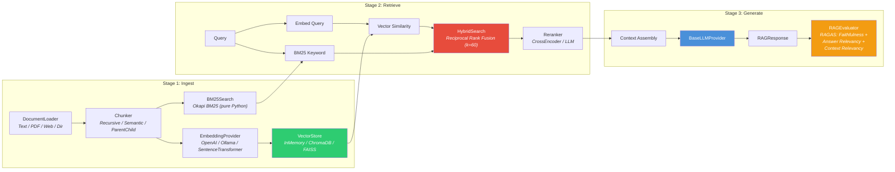

# AgentWeave

> **Protocol-First Multi-Agent Framework for Python**
>
> Build production-grade AI agent systems with native MCP/A2A protocol support, full-stack RAG, and built-in resilience -- not just wrappers, but framework-level engineering.

[](https://www.python.org/downloads/)
[](https://opensource.org/licenses/MIT)
[]()
[]()
[]()
[]()

AgentWeave is an async-first Python framework for building multi-agent AI systems with native protocol support for [MCP](https://modelcontextprotocol.io/) (Model Context Protocol) and [A2A](https://google.github.io/A2A/) (Agent-to-Agent). Every layer -- from LLM abstraction to RAG evaluation -- is designed, implemented, and tested from scratch.

---

## Why AgentWeave?

Most agent frameworks wrap existing APIs with convenience layers. AgentWeave takes a different approach: **every component is built from protocol-level abstractions upward**, giving you full control and deep understanding of each layer.

| | AgentWeave | LangChain / LangGraph | CrewAI | AutoGen |
|---|---|---|---|---|
| **Architecture** | Protocol-first (MCP + A2A native) | Chain / Graph abstractions | Role-based crews | Conversation patterns |
| **LLM Providers** | 4 built-in (OpenAI, Anthropic, Gemini, Ollama) with `BaseLLMProvider` ABC | 80+ via integrations | LiteLLM wrapper | OpenAI-centric |
| **RAG** | Full-stack built-in (BM25 + Vector + RRF + RAGAS eval) | External (LangSmith) | Plugin-based | None |
| **Workflow Engine** | Flow DSL with Sequential / Parallel / Composite executors | Graph-based (nodes + edges) | Task delegation | Multi-turn conversation |
| **Cost Tracking** | Built-in per-agent / per-workflow with budget limits | Callback-based | Built-in telemetry | None |
| **Resilience** | Circuit Breaker + Retry + Timeout (Pydantic config) | Via LangSmith | None | None |
| **Observability** | OpenTelemetry native + TraceCollector | LangSmith (proprietary SaaS) | Built-in | None |
| **Type Safety** | Pydantic v2 + mypy strict + `py.typed` (PEP 561) | Partial | Partial | Partial |
| **Structured Output** | Pydantic schema -> JSON Schema -> LLM -> validation | Via output parsers | None | None |
| **Memory** | 3 types + 3 persistent backends (JSON, SQLite, custom) | Built-in | Short/Long-term | Chat history |

**The core philosophy**: Understanding how to *build* a framework, not just how to *use* one.

---

## Architecture

### Core Architecture

```mermaid
graph TB
    subgraph Agent Layer
        Agent[Agent]
        AgentConfig[AgentConfig<br/><i>Pydantic</i>]
    end

    subgraph LLM Providers
        Base[BaseLLMProvider<br/><i>ABC</i>]
        OpenAI[OpenAIProvider]
        Anthropic[AnthropicProvider]
        Gemini[GeminiProvider]
        Ollama[OllamaProvider]
        Registry[ProviderRegistry]
    end

    subgraph Tool System
        ToolDec["@tool decorator"]
        ToolBase[Tool]
        ToolExec[ToolExecutor]
        MCP[MCPClient<br/><i>MCP Protocol</i>]
        MCPAdapter[MCPAdapter<br/><i>MCPTool -> Tool</i>]
    end

    subgraph Memory
        BaseMem[BaseMemory<br/><i>ABC</i>]
        ConvMem[ConversationMemory]
        SemMem[SemanticMemory]
        WorkMem[WorkingMemory]
        MemStore[MemoryStore<br/><i>JSON / SQLite</i>]
    end

    subgraph Workflow Engine
        Workflow[Workflow]
        FlowDSL[Flow DSL Parser<br/><i>'A -> &#91;B, C&#93; -> D'</i>]
        SeqExec[SequentialExecutor]
        ParExec[ParallelExecutor]
        CompExec[CompositeExecutor]
    end

    subgraph Resilience
        ResConfig[ResilienceConfig]
        Retry[RetryPolicy]
        CB[CircuitBreaker]
        TM[TimeoutManager]
    end

    subgraph Observability
        CostTracker[CostTracker<br/><i>Budget + Alerts</i>]
        Tracer[AgentWeaveTracer<br/><i>OpenTelemetry</i>]
        Collector[TraceCollector<br/><i>JSON/JSONL export</i>]
        Callbacks[CallbackManager]
    end

    subgraph Protocols
        A2AClient[A2AClient]
        A2AServer[A2AServer]
    end

    Agent --> AgentConfig
    Agent --> Base
    Agent --> ToolExec
    Agent --> BaseMem
    Agent --> MCP
    Agent --> ResConfig
    Agent --> CostTracker
    Agent --> Callbacks

    Base --> OpenAI
    Base --> Anthropic
    Base --> Gemini
    Base --> Ollama
    Registry --> Base

    ToolDec --> ToolBase
    ToolBase --> ToolExec
    MCP --> MCPAdapter --> ToolExec

    BaseMem --> ConvMem
    BaseMem --> SemMem
    BaseMem --> WorkMem
    ConvMem --> MemStore

    Workflow --> FlowDSL
    FlowDSL --> SeqExec
    FlowDSL --> ParExec
    FlowDSL --> CompExec
    Workflow --> Agent

    ResConfig --> Retry
    ResConfig --> CB
    ResConfig --> TM

    Tracer --> Collector

    Agent --> A2AServer
    A2AClient --> Agent

    style Agent fill:#4A90D9,color:#fff
    style Workflow fill:#4A90D9,color:#fff
    style Base fill:#7B68EE,color:#fff
    style BaseMem fill:#2ECC71,color:#fff
    style ResConfig fill:#E74C3C,color:#fff
    style CostTracker fill:#F39C12,color:#fff
    style Tracer fill:#F39C12,color:#fff
    style MCP fill:#9B59B6,color:#fff
```



### RAG Pipeline Architecture



---

## Features

- **Multi-Provider LLM Support** -- OpenAI, Anthropic, Google Gemini, Ollama (local), with a unified `BaseLLMProvider` interface
- **Multi-Agent Orchestration** -- AgentTeam with 4 strategies (coordinator, round_robin, debate, map_reduce), delegation-as-tools pattern, MessageBus for agent communication, SharedContext for thread-safe state
- **Workflow Orchestration** -- Sequential, parallel, and mixed execution via intuitive Flow DSL (`"A -> [B, C] -> D"`)
- **Protocol Native** -- Built-in MCP client/adapter and A2A client/server, not bolted-on wrappers
- **Tool System** -- Pythonic `@tool` decorator with automatic JSON Schema generation from type hints
- **Memory** -- Conversation, semantic, and working memory with persistent backends (JSON, SQLite)
- **Resilience** -- Retry policies, circuit breakers, and timeout management via composable `ResilienceConfig`
- **Cost Tracking** -- Per-agent and per-workflow token usage, cost monitoring, and budget alerts
- **RAG Pipeline** -- Full-stack: document loading, chunking (3 strategies), embedding, hybrid search (BM25 + Vector + RRF), reranking, and RAGAS evaluation
- **Streaming** -- Real-time token streaming with tool calling support (hybrid stream + complete)
- **Structured Output** -- Pydantic model to JSON Schema, OpenAI `response_format`, and automatic validation
- **Observability** -- OpenTelemetry native tracing (agent/workflow/LLM/tool spans) + TraceCollector for JSON export
- **Lifecycle Management** -- Async context managers for agents and workflows (`async with Agent(...) as agent:`)

---

## Quick Start

### Installation

```bash
pip install agentweave

# With specific providers
pip install agentweave[openai]
pip install agentweave[anthropic]
pip install agentweave[all]  # Everything

# With RAG support
pip install agentweave[rag]       # ChromaDB
pip install agentweave[rag-full]  # ChromaDB + FAISS + SentenceTransformers + PDF
```

### Your First Agent

```python
from agentweave import Agent

agent = Agent(
    name="assistant",
    role="Helpful AI assistant",
    model="gpt-4o-mini",
)

result = agent.run_sync("What is AgentWeave?")
print(result.output)
print(f"Tokens: {result.usage.total_tokens}, Cost: ${result.cost:.4f}")
```

### Multi-Agent Workflow

```python
from agentweave import Agent, Workflow

researcher = Agent(name="researcher", role="Research specialist", model="gpt-4o-mini")
writer = Agent(name="writer", role="Content writer", model="gpt-4o-mini")
reviewer = Agent(name="reviewer", role="Quality reviewer", model="gpt-4o-mini")

workflow = Workflow(
    agents=[researcher, writer, reviewer],
    flow="researcher -> writer -> reviewer",
)

result = workflow.run_sync("Write about AI trends")
print(result.output)
print(f"Total cost: ${result.total_cost:.4f}")
```

### Multi-Agent Orchestration

Coordinate multiple agents using built-in strategies:

```python
from agentweave import Agent, AgentTeam

# Define specialized agents
researcher = Agent(name="researcher", role="Research expert", model="gpt-4o-mini")
writer = Agent(name="writer", role="Content writer", model="gpt-4o-mini")
reviewer = Agent(name="reviewer", role="Quality reviewer", model="gpt-4o-mini")

# Create coordinated team
team = AgentTeam(
    name="content-team",
    members=[researcher, writer, reviewer],
    strategy="coordinator",  # coordinator, round_robin, debate, map_reduce
    max_rounds=5,
)

result = await team.run("Write a blog post about AI safety")
print(result.output)
print(f"Cost: ${result.total_cost:.4f}, Rounds: {result.rounds}")
```

**Orchestration Strategies:**

| Strategy | Pattern | Best For |
|----------|---------|----------|
| `coordinator` | Delegation via tools | Complex hierarchical tasks |
| `round_robin` | Sequential pipeline | Iterative refinement workflows |
| `debate` | Multi-perspective synthesis | Decision analysis, brainstorming |
| `map_reduce` | Parallel decomposition + aggregation | Data processing, divide-and-conquer |

### Parallel Execution

```python
workflow = Workflow(
    agents=[analyst1, analyst2, summarizer],
    flow="[analyst1, analyst2] -> summarizer",
)
```

### Tools

```python
from agentweave import Agent, tool

@tool(description="Get current weather")
def get_weather(city: str) -> str:
    return f"Weather in {city}: 22C, Sunny"

agent = Agent(
    name="weather-bot",
    role="Weather assistant",
    model="gpt-4o-mini",
    tools=[get_weather],
)

result = await agent.run("What's the weather in Seoul?")
```

### Streaming

```python
async for chunk in agent.stream("Tell me a story"):
    print(chunk.delta, end="", flush=True)
```

### Multiple Providers

```python
# OpenAI
agent = Agent(name="gpt", role="Assistant", model="gpt-4o")

# Anthropic
agent = Agent(name="claude", role="Assistant", model="claude-3-5-sonnet")

# Google Gemini
agent = Agent(name="gemini", role="Assistant", model="gemini-2.0-flash")

# Ollama (local)
agent = Agent(name="local", role="Assistant", model="ollama/llama3.2")
```

### MCP Integration

```python
from agentweave import Agent, MCPClient

async with MCPClient() as mcp:
    await mcp.connect("npx", ["-y", "@anthropic/mcp-server-github"])

    agent = Agent(name="dev", role="Developer", model="gpt-4o", mcp_client=mcp)
    await agent.setup_mcp()

    result = await agent.run("List recent issues")
```

### Resilience

```python
from agentweave import Agent, ResilienceConfig, RetryPolicy, CircuitBreaker

agent = Agent(
    name="robust",
    role="Reliable assistant",
    model="gpt-4o-mini",
    resilience=ResilienceConfig(
        retry_policy=RetryPolicy(max_retries=3),
        circuit_breaker_enabled=True,
        circuit_breaker=CircuitBreaker(failure_threshold=5),
    ),
)
```

### Memory

```python
from agentweave import Agent, ConversationMemory

memory = ConversationMemory()
agent = Agent(
    name="chatbot",
    role="Conversational assistant",
    model="gpt-4o-mini",
    memory=memory,
)

await agent.run("My name is Alice")
await agent.run("What's my name?")  # Remembers: Alice
```

### Structured Output

```python
from pydantic import BaseModel
from agentweave import Agent, OutputSchema

class MovieReview(BaseModel):
    title: str
    rating: float
    summary: str
    pros: list[str]
    cons: list[str]

agent = Agent(name="critic", role="Film critic", model="gpt-4o-mini")
result = await agent.run(
    "Review the movie Inception",
    output_schema=OutputSchema(MovieReview),
)
review = result.structured_output  # Validated MovieReview instance
```

### RAG Pipeline

```python
from agentweave import RAGPipeline, Document
from agentweave.rag.embeddings.openai import OpenAIEmbeddings
from agentweave.llm.openai import OpenAIProvider

pipeline = RAGPipeline(
    llm=OpenAIProvider(model="gpt-4o-mini"),
    embedding_provider=OpenAIEmbeddings(),
)

# Ingest documents
docs = [Document(id="doc1", content="AgentWeave is a multi-agent framework...")]
await pipeline.ingest_documents(docs)

# Query with hybrid search (Vector + BM25 + RRF)
response = await pipeline.query("What is AgentWeave?")
print(response.answer)
print(f"Sources: {response.source_documents}")
```

### Cost Tracking

```python
from agentweave import Agent, CostTracker

tracker = CostTracker(budget_limit=10.0)  # $10 budget
agent = Agent(name="tracked", role="Assistant", model="gpt-4o-mini", cost_tracker=tracker)

await agent.run("Hello!")
summary = tracker.get_summary()
print(f"Total cost: ${summary.total_cost:.4f}")
print(f"Total tokens: {summary.total_tokens:,}")
```

### Observability (OpenTelemetry)

```python
from agentweave import Agent, AgentWeaveTracer, setup_telemetry

# Auto-instrument all agent/workflow/LLM/tool operations
setup_telemetry(service_name="my-agent-app")

agent = Agent(name="traced", role="Assistant", model="gpt-4o-mini")
result = await agent.run("Hello!")
# Spans exported to your configured OTel backend (Jaeger, Datadog, etc.)
```

---

## Provider Support

| Provider | Models | Protocol | Extra Required |
|----------|--------|----------|---------------|
| OpenAI | gpt-4o, gpt-4o-mini, gpt-3.5-turbo | REST (openai SDK) | `pip install agentweave[openai]` |
| Anthropic | claude-3-5-sonnet, claude-3-haiku | REST (anthropic SDK) | `pip install agentweave[anthropic]` |
| Google Gemini | gemini-2.0-flash, gemini-1.5-pro | OpenAI-compat (httpx) | None |
| Ollama | llama3.2, mistral, phi3, etc. | OpenAI-compat (httpx) | None |

All providers implement the same `BaseLLMProvider` ABC -- swap providers with a single line change.

---

## Examples

See the [examples/](examples/) directory for 16 complete examples:

| # | File | Description |
|---|------|-------------|
| 01 | hello_world.py | Basic Agent usage |
| 02 | multi_model.py | Multiple LLM providers |
| 03 | workflow_sequential.py | Sequential workflow |
| 04 | workflow_parallel.py | Parallel workflow |
| 05 | with_mcp.py | MCP integration |
| 06 | a2a_server.py | Agent-to-Agent protocol |
| 07 | memory_system.py | Memory usage |
| 08 | cost_tracking.py | Token and cost tracking |
| 09 | tools.py | Tool system |
| 10 | streaming.py | Streaming with tools |
| 11 | full_agent.py | All features combined |
| 12 | memory_persistence.py | Persistent memory stores (JSON, SQLite) |
| 12 | lifecycle_management.py | Async context managers |
| 12 | trace_collector.py | Execution tracing and export |
| 13 | structured_output.py | Structured output with Pydantic |
| 14 | rag_pipeline.py | RAG ingest, retrieve, generate |

---

## Comparison

A detailed feature-by-feature comparison with other popular agent frameworks:

| Feature | AgentWeave | LangGraph | CrewAI | AutoGen |
|---------|-----------|-----------|--------|---------|
| **LLM Providers** | 4 built-in (OpenAI, Anthropic, Gemini, Ollama) | 80+ via integrations | LiteLLM wrapper | OpenAI-centric |
| **Provider Interface** | `BaseLLMProvider` ABC (custom providers in ~50 LOC) | `BaseChatModel` | LiteLLM | `ModelClient` |
| **Workflow Patterns** | Sequential, Parallel, Composite (Flow DSL) | Graph (nodes + edges) | Task delegation | Conversation turns |
| **Memory Types** | Conversation + Semantic + Working | Checkpointer | Short-term + Long-term | Chat history |
| **Memory Persistence** | JSON file, SQLite, custom `MemoryStore` ABC | SQLite, PostgreSQL | None built-in | None |
| **Tool System** | `@tool` decorator + auto JSON Schema | `@tool` decorator | `@tool` decorator | Function calling |
| **RAG Pipeline** | Full built-in (Loader -> Chunk -> Embed -> Search -> Rerank -> Generate) | Via retrievers | None built-in | None |
| **RAG: Chunking** | Recursive, Semantic, Parent-Child | RecursiveText | N/A | N/A |
| **RAG: Search** | BM25 + Vector + Hybrid (RRF k=60) | Vector only | N/A | N/A |
| **RAG: Evaluation** | RAGAS (Faithfulness, Answer Relevancy, Context Relevancy) | None | N/A | N/A |
| **Protocol: MCP** | Native client + adapter (MCPTool -> Tool bridge) | Via integration | None | None |
| **Protocol: A2A** | Native client + server | None | None | None |
| **Cost Tracking** | Built-in CostTracker (budget limits, alerts, per-model pricing) | Callbacks | Built-in | None |
| **Resilience** | RetryPolicy + CircuitBreaker + TimeoutManager (composable) | None built-in | None | None |
| **Observability** | OpenTelemetry native (agent/workflow/LLM/tool spans) | LangSmith (SaaS) | Built-in | None |
| **Tracing Export** | TraceCollector (JSON/JSONL, save/load round-trip) | LangSmith | Proprietary | None |
| **Structured Output** | Pydantic -> JSON Schema -> LLM -> validate | Output parsers | None | None |
| **Streaming** | `agent.stream()` with tool calling (hybrid complete + stream) | Streaming events | None | None |
| **Type Safety** | mypy strict + `py.typed` (PEP 561) | Partial types | Partial | Partial |
| **Async** | async-first (`asyncio`), `run_sync()` convenience | async-first | sync-first | async |
| **Tests** | 701 (82% coverage, CI matrix Py 3.10-3.12) | Varies | Varies | Varies |
| **Dependencies** | 4 core (pydantic, httpx, rich, tenacity) | 15+ | 10+ | 5+ |

---

## Project Structure

```
agentweave/
├── core/              # Agent, Workflow, Executor, State, Config, Structured Output
│   ├── agent.py       #   Agent class (run, stream, tool loop, memory, resilience)
│   ├── workflow.py    #   Workflow class + FlowParser (DSL -> Executors)
│   ├── executor.py    #   Sequential / Parallel / Composite executors
│   ├── structured.py  #   OutputSchema (Pydantic -> JSON Schema -> validation)
│   └── types.py       #   AgentResult, LLMResponse, Message, ToolCall, Usage
├── llm/               # LLM Provider abstraction layer
│   ├── base.py        #   BaseLLMProvider ABC (complete, stream)
│   ├── openai.py      #   OpenAI provider (tool calls, streaming)
│   ├── anthropic.py   #   Anthropic provider (tool_use blocks)
│   ├── gemini.py      #   Gemini provider (OpenAI-compat via httpx)
│   ├── ollama.py      #   Ollama provider (local models via httpx)
│   └── registry.py    #   ProviderRegistry (model prefix -> provider routing)
├── protocols/         # Inter-agent communication protocols
│   ├── mcp/           #   MCP client, adapter (MCPTool -> Tool bridge), types
│   └── a2a/           #   A2A client, server, types (AgentCard, Task, Message)
├── tools/             # Tool system
│   ├── decorator.py   #   @tool decorator (inspect -> JSON Schema)
│   ├── base.py        #   Tool, ToolParameter dataclasses
│   └── executor.py    #   ToolExecutor (dispatch, error handling)
├── memory/            # Memory subsystem
│   ├── base.py        #   BaseMemory ABC, MemoryEntry (Pydantic)
│   ├── conversation.py#   ConversationMemory (windowed history)
│   ├── semantic.py    #   SemanticMemory (embedding-based recall)
│   ├── working.py     #   WorkingMemory (key-value scratchpad)
│   └── stores/        #   Persistent backends (JSONFileStore, SQLiteStore)
├── resilience/        # Fault tolerance
│   ├── config.py      #   ResilienceConfig (unified Pydantic config)
│   ├── retry.py       #   RetryPolicy (exponential backoff, jitter)
│   ├── circuit_breaker.py  # CircuitBreaker (failure threshold, half-open)
│   └── timeout.py     #   TimeoutManager (per-operation timeouts)
├── tracking/          # Cost and usage tracking
│   ├── cost.py        #   CostTracker (budget limits, alerts, thread-safe)
│   ├── pricing.py     #   Per-model token pricing tables
│   ├── models.py      #   TokenUsage, CostEntry, CostSummary
│   └── callbacks.py   #   CallbackManager (lifecycle hooks)
├── telemetry/         # Observability
│   ├── tracer.py      #   AgentWeaveTracer (OpenTelemetry spans)
│   ├── metrics.py     #   AgentWeaveMetrics (OTel counters/histograms)
│   └── collector.py   #   TraceCollector (JSON/JSONL export, save/load)
├── rag/               # Retrieval-Augmented Generation
│   ├── pipeline.py    #   RAGPipeline (ingest -> retrieve -> generate)
│   ├── types.py       #   Document, Chunk, SearchResult, RAGResponse
│   ├── tools.py       #   create_rag_tools() (Agentic RAG via Tool calling)
│   ├── loaders/       #   TextLoader, DirectoryLoader, PDFLoader, WebLoader
│   ├── chunking/      #   RecursiveCharacter, Semantic, ParentChild
│   ├── embeddings/    #   OpenAI, Ollama, SentenceTransformer
│   ├── vectorstore/   #   InMemory, ChromaDB, FAISS
│   ├── search/        #   BM25Search, HybridSearch (RRF), Reranker
│   └── evaluation/    #   RAGEvaluator (Faithfulness, AnswerRelevancy, ContextRelevancy)
├── logging/           # Structured logging (JSON prod / text dev)
└── errors/            # Exception hierarchy (AgentWeaveError -> specialized)
```

---

## Benchmarks

23 performance benchmarks measure framework overhead using mock providers (no real LLM calls):

| Category | Benchmark | Target | Method |
|----------|-----------|--------|--------|
| **Agent Execution** | Run latency | < 10ms avg, < 20ms p99 | 100 iterations |
| | With memory | < 15ms avg | 100 iterations |
| | With cost tracker | < 15ms avg | 50 iterations |
| | Throughput | > 50 ops/sec | 100 sequential runs |
| | Streaming | < 10ms avg | 50 iterations |
| **Memory** | Conversation add (1K entries) | < 100ms | Bulk insert |
| | Conversation search (5K entries) | < 500ms | 100 searches |
| | Semantic search (500 entries) | < 2000ms | 50 searches |
| | Working memory ops (1K cycles) | < 100ms | Set + Get |
| **Workflow** | Sequential (3 agents) | < 50ms avg | 20 runs |
| | Parallel (5 agents) | < 50ms avg | 20 runs |
| | Complex mixed (10 agents) | < 100ms avg | 10 runs |
| **Structured Output** | Schema validation (1K) | < 500ms | Pydantic |
| | JSON extraction (1K) | < 1000ms | Markdown-wrapped |
| **Cost Tracking** | Track 1K entries | < 100ms | Bulk |
| | Generate summary | < 50ms | 100 calls |
| **Tool Execution** | Registration (10 tools) | < 10ms | Register |
| | Sync execution (500) | < 100ms | Call |
| | Async execution (500) | < 100ms | Call |

```bash
make bench  # Run all 23 benchmarks
```

---

## Development

```bash
# Install dev dependencies
pip install -e ".[all]"
pip install pytest pytest-asyncio pytest-cov ruff mypy

# Run tests
make test              # All tests (701 tests)
make test-unit         # Unit tests only
make test-integration  # Integration tests only
make test-cov          # With coverage report

# Code quality
make lint              # Ruff linter
make format            # Ruff formatter
make typecheck         # mypy strict mode
make all               # All checks
```

### CI/CD

- GitHub Actions matrix: Python 3.10, 3.11, 3.12
- Pre-commit hooks: ruff lint + format
- Coverage threshold: 75% (fail_under)
- Automated PyPI publishing via OIDC trusted publisher

---

## License

MIT License -- see [LICENSE](LICENSE) for details.
